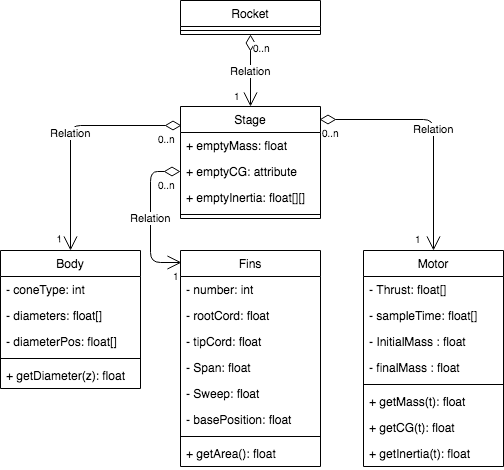

# ERT_FLIGHT_SIMULATOR

Repository for the EPFL Rocket Team's flight simulator translated to Python.

The aim is to create a GUI from the existing Matlab code.

Initial steps are
1. Create a rocket from objects as below

2. Implement a 1D model
3. Implement a 3D model

**Run the code from /venv/Include**

# Technical information
Nose cone design : https://en.wikipedia.org/wiki/Nose_cone_design

Nose cone software design : https://www.instructables.com/id/Design-a-Rocket-Nose-Cone-with-Software/

Literature and volumes : https://aviation.stackexchange.com/questions/24414/why-when-is-the-blunt-nose-better

Useful notes for OpenRocket : http://openrocket.sourceforge.net/techdoc.pdf